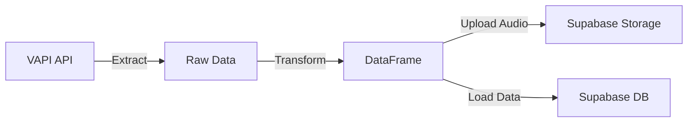

# 🎙️ VAPI ETL Pipeline

[](https://www.python.org/downloads/)
[](https://github.com/psf/black)
[](https://opensource.org/licenses/MIT)

> A sleek ETL pipeline for processing VAPI call data and audio recordings with Supabase integration. Built for the modern data stack. 🚀

## ✨ Features

- 🔄 **Efficient ETL Pipeline**: Extract call data from VAPI v2, transform, and load into Supabase
- 📊 **Smart Data Handling**: Pagination support and incremental updates
- 🎵 **Parallel Audio Processing**: Fast, concurrent audio recording uploads
- 📝 **Rich Logging**: Beautiful console output and rotating log files
- 🔍 **Data Validation**: Schema validation and error tracking
- 📈 **Progress Tracking**: Real-time metrics and ETL summaries

## 🚀 Quick Start

1. **Clone the repo**
   ```bash
   git clone https://github.com/ronaks2309/vapi-elt-job.git
   cd vapi-elt-job
   ```

2. **Set up environment**
   ```bash
   python -m venv venv
   source venv/bin/activate  # On Windows: .\venv\Scripts\activate
   pip install -r requirements.txt
   ```

3. **Configure environment variables**
   ```bash
   cp .env.example .env
   # Edit .env with your credentials:
   # - VAPI_API_KEY
   # - SUPABASE_URL
   # - SUPABASE_SERVICE_KEY
   ```

4. **Run the pipeline**
   ```bash
   python main.py
   ```

## 📊 How It Works



1. **Extract**: Fetch call data from VAPI v2 API with pagination
2. **Transform**: Convert to structured DataFrame with schema validation
3. **Upload**: Parallel upload of audio recordings to Supabase storage
4. **Load**: Upsert transformed data to Supabase with audit tracking

## 🛠️ Development

### Project Structure
```
vapi-elt-job/
├── main.py           # Pipeline entry point
├── extract.py        # VAPI data extraction
├── transform.py      # Data transformation logic
├── upload_audio.py   # Audio file processing
├── load.py          # Supabase loading
└── utils/           # Shared utilities
```

### Key Components
- `extract.py`: VAPI v2 API integration with pagination
- `transform.py`: Data structure transformation
- `upload_audio.py`: Parallel audio processing
- `load.py`: Supabase integration with schema validation

## 📝 Logging

Beautiful console output with the `rich` library:
```python
logger = get_logger(__name__, use_rich=True)
logger.info("Starting extraction...")
logger.success("✅ ETL complete!")
```

## 🤝 Contributing

1. Fork the repository
2. Create a feature branch
3. Commit your changes
4. Push to your branch
5. Open a pull request

## 📄 License

This project is licensed under the MIT License - see the [LICENSE](LICENSE) file for details.

## 🙏 Acknowledgments

- [VAPI](https://vapi.ai/) for their excellent API
- [Supabase](https://supabase.com/) for the robust storage solution
- All contributors who help improve this project

---
Made with ❤️ as a weekend project. Star ⭐ if you found it useful!